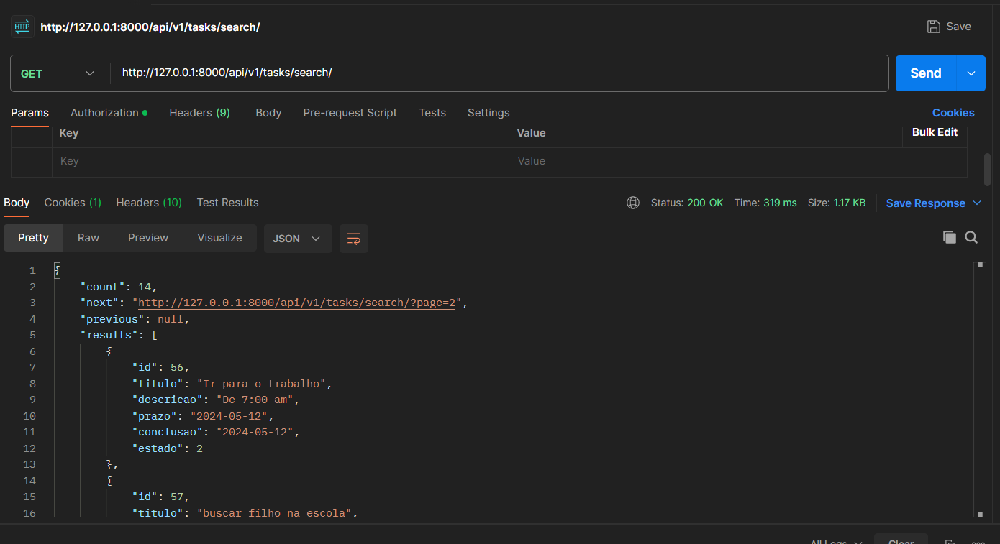

## TO DO LIST API - É uma API REST criada para um Sistema de Gerenciamento de Tarefas.  


### Descrição
Essa API ajuda no gerenciamento de uma lista de tarefas (to-do list). A API permite que os usuários criem, atualizem, excluam e visualizem tarefas. Cada tarefa possue um Titulo, uma Descrição, um Prazo (data planejada para conclusão), uma Data da Conclusão, e uma Situação que pode ser (nova, em andamento, concluída ou cancelada).

- ### Tecnologias Utilizadas.
  
  
  

### Passos Iniciais.
- ### O que é uma API ?
  API é um termo para designar uma interface de comunicação que um sistema oferece para que outros acessem suas funções, dados e recursos sem que o software ou plataforma externa precise saber como eles foram implementados. Trata-se de um conjunto de rotinas e padrões muito utilizados na web para facilitar a integração entre diferentes sites e aplicativos.

- ### Como Funciona uma API RESTFUL ?
  Uma API RESTful funciona através da manipulação de recursos e representações. Essas representações são trocadas entre os usuários e o servidor através de uma interface padronizada e de um protocolo de comunicação específico — geralmente o HTTP. Assim, quando um usuário deseja usar uma funcionalidade da aplicação, seu dispositivo envia uma solicitação via HTTP ao servidor. O servidor localiza o recurso e comunica a representação do estado dele na resposta ao usuário através do mesmo protocolo. E são essas representações que podem ser feitas em diversos formatos.

  Caso ainda tenha duvidas de como uma API RESTFUL funciona, recomendo a leitura do site: (https://www.hostinger.com.br/tutoriais/api-restful)

### Como Instalar o Projeto.
- #### Clone esse Reposítorio em sua maquina, isso pode ser feito via git com o comando:
  ``` git clone https://github.com/kaiquevieirasoares/api-to-do-list.git```


  ou diretamente do Github:


  

- ### Com o projeto em mãos você terá acesso a essa estrutura de codigo:
  - Observe que a pasta venv não estara em seu projeto, logo sera necessário cria-la para instalar os requerimentos.
  

- ### Dentro do Diretório Principal (api-to-do-list), no terminal, execute o seguinte comando para criar a maquina virtual:
  ``` python3 -m venv venv ``` no Linux ou ``` python -m venv venv ``` para Windows.

- ### Agora vamos instalar os requerimentos para startar a API.
  Utilize o sequinte comando para instalar os requerimentos.
  - Lembre de instalar as dependencias com a maquina virtual ativa.
  - ```./pip install -r requirements.txt ```
  


| Bibliotecas | Versão | 
|:----------|------|
|asgiref | 3.8.1|
|Django  | 5.0.6 | 
|django-cors-headers |  4.3.1| 
|django-filter |  24.2| 
|djangorestframework== | 3.15.1|  
|sqlparse |  0.5.0|  
|tzdata |  2024.1|  

## Startando a API
Com Todos os passsoas anteriores concluídos. Vamos Inicar o projeto.

### Criando um Super Usuário. 
-  é necessário criar um Super Usuário para que o servidor Django possa ser iniciado, crie utilizando o exemplo a seguir.
   ```python3 manage.py createsuperuser``` no Linux e python ``` python manage.py createsuperuser```
   
   
   
### Povoando o Banco de Dados. 
-  Vamos Povoar o Banco de Dados Utilizando o comando utilizando o Django Commands.
   ```python3 manage.py db_population``` no Linux e python ```python manage.py db_population```
   
   
   
### Pronto! Agora já podemos iniciar o server. Utilize o comando a seguir:

```python3 manage.py db_population``` para Linux or ```python manage.py db_population``` para windows.


Vamos lá ❤️


### Como Utilizar a API ?
Primeiramente vamos entender o que significa os termos técnicos da aplicação.

- ### END-POINTS:
  O URL do endpoint é a localização exata do recurso solicitado ao servidor de API, permitindo que dois programas interajam. No endpoint, a API acessará os recursos necessários de um servidor para executar uma tarefa especificada, como recuperar determinados dados ou informações. As APIs enviam solicitações para acessar dados de um servidor com uma resposta enviada de volta. O local da resposta é o endpoint.
  
  - Nossa API possui 5  END_POINTS, ou seja, 5 endereços com diferentes funções de requisição, sendo elas:
  ### Obs:```http://127.0.0.1:8000``` é a parte estatica da aplicação, pode ser alterada para diferentes sistemas.

   ### GET ALL - Retorna todas as tarefas(Tasks) com paginação de 5.
    - Obs: O numero da paginação pode ser alterada em Settings.py
    
    - ```http://127.0.0.1:8000/api/v1/tasks/```
      

  ### GET By ID - Retorna uma tarefa (Task) especifica a partir do id.
    - ```http://127.0.0.1:8000/api/v1/tasks/get/55```
      
 
      
  ### CREATE - POST - Cria uma tarefa uma tarefa (Task).
     - Observe que o status está como 400, isso ocorre porque chamamos o END-POINT sem passar as informações obrigatórias.
    - ```http://127.0.0.1:8000/api/v1/tasks/create/```
      
 
  ### UPDATE - PATCH and PUT- Atualiza uma tarefa já existente.
     - Usando o PUT, é necessário que todas as informações sejam atualizadas.
     - Observe que o status está como 400, isso ocorre porque chamamos o END-POINT sem passar todas as informações obrigatórias.
    - ```http://127.0.0.1:8000/api/v1/tasks/update/55```
      
      
    - ##### Agora obeserve o mesmo END-POINT como uma requisição do tipo PATCH.
      
      
 

  ### DELETE - Deleta do Banco de Dados uma tarefa (task) especifica a partir do ID.
    - Observe que o código foi 204, ele indica que a solicitação foi bem sucedida e o cliente não precisa sair da página atual.
    - ```http://127.0.0.1:8000/api/v1/tasks/delete/55```
      
    

  ### SEARCH - Esse END-POINT realiza uma pesquisa por tarefas semelhantes no titulo e descrição.
    - Observe que esse END-POINT pode ser chamado de duas formas:
    - Nesse caso não especificamos a pesquisa, logo, todas as tarefas serão requisitadas.
    - ```(http://127.0.0.1:8000/api/v1/tasks/search/)```
      
    - Na seguna imagem, especificamos a palavra de pesquisa, será requisitada apenas as tarefas semelhantes.
    - ```(http://127.0.0.1:8000/api/v1/tasks/search/?search=carro)```
      

### Status http durante as requisições:


### Faça bom proveito dessa aplicação, ela foi construída de uma forma em que seja fácil reutiliza-la em outros projetos, ou até mesmo implementar novas funcionalidades, sinta-se livre.

I love programming ❤️


